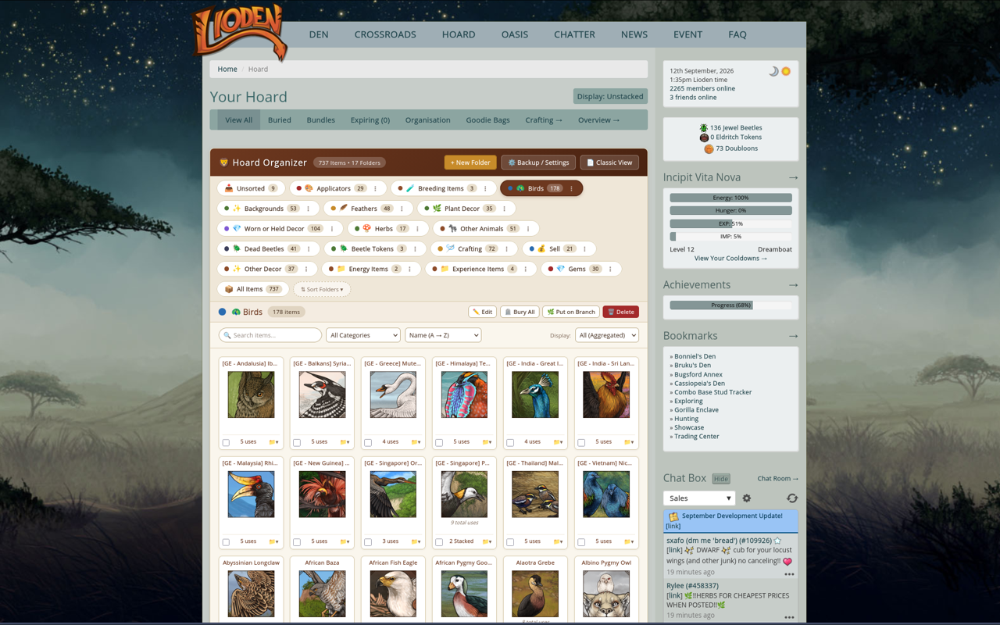

# Lioden Hoard Organizer

A standalone browser extension (Manifest V3) for [Lioden](https://www.lioden.com) that allows you to organize your Hoard into user-created folders, aggregates all items across pages, and provides instant filtering, sorting, and drag-and-drop organization.



---

## Features

- **Custom Folders**: Create, rename, customize icons and colors, and delete folders (e.g. *Breeding Items*, *Decorations*, *Food to Sell*, *Hoard / Long Term*).
- **All Items Aggregated**: Displays all items from your hoard in one unified, responsive grid without being restricted to 20/40/60/100 pagination chunks.
- **Drag-and-Drop Sorting**: Pick up any item card and drop it onto a folder tab at the top to instantly categorize it.
- **Multi-Item Drag & Bulk Actions**: Select multiple items with checkboxes, then drag one to move all of them, or use the multi-select toolbar to batch move them to any folder.
- **Quick-Move Menu**: Click the `📁▾` button on any item card for a fast dropdown to move that item to any folder or create a new one on the fly.
- **Instant Search & Category Filters**: Search by item name in real time with instant filtering and sorting (Name, Uses, Quantity, Expiring Soonest).
- **Native Action Support**: Checkboxes and forms remain 100% compatible with Lioden's native actions (e.g. **Bury Checked**).
- **Backup & Restore**: Export your folder configuration and item assignments to a JSON file to transfer between browsers or restore anytime.
- **Classic View Toggle**: Switch back to Lioden's original unorganized layout at any time with a single click.

---

## Installation

### Chrome / Chromium / Edge / Brave / Opera

1. Open your browser and navigate to `chrome://extensions/` (or `edge://extensions/`).
2. Enable **Developer mode** (toggle switch in the top-right corner).
3. Click **Load unpacked**.
4. Select the `lioden-hoard-sorter` folder.
5. Navigate to [Lioden Hoard](https://www.lioden.com/hoard.php) to see your new Hoard Organizer!

### Firefox

1. Open Firefox and navigate to `about:debugging#/runtime/this-firefox`.
2. Click **Load Temporary Add-on...**.
3. Select the `manifest.json` file inside the `lioden-hoard-sorter` folder.
4. Navigate to [Lioden Hoard](https://www.lioden.com/hoard.php).

### Orion (iOS / iPadOS)

1. Download the release `.zip` file (e.g., `lioden-hoard-organizer-latest.zip` or `lioden-hoard-organizer-v1.0.2.zip`) and save it to the **Files** app. *(Do not tap the file in Files to unzip it; Orion requires the `.zip` archive directly).*
2. Open **Orion**.
3. Tap the **•••** menu in the bottom-right (or top-right on iPad) -> **Settings**.
4. Scroll down to **Extensions** and ensure extension support is toggled **ON**.
5. Tap **•••** -> **Extensions**.
6. Tap the **+** button in the top-right corner.
7. Select the `.zip` file from the Files picker.
8. Navigate to [Lioden Hoard](https://www.lioden.com/hoard.php).

### Orion (macOS)

1. Download and unzip `lioden-hoard-organizer-latest.zip`.
2. Open Orion and click **Tools** -> **Extensions** -> **Add Extension** (or **Install from Disk...**).
3. Select the unzipped folder containing `manifest.json`.
4. Navigate to [Lioden Hoard](https://www.lioden.com/hoard.php).

### Android (Kiwi Browser / Lemur Browser)

1. Open Kiwi Browser or Lemur Browser.
2. Tap the three dots **(⋮)** -> **Extensions**.
3. Enable **Developer mode**.
4. Tap **+(from .zip/.crx/.user.js)** and select `lioden-hoard-organizer-latest.zip`.
5. Navigate to [Lioden Hoard](https://www.lioden.com/hoard.php).

---

## Packaging & Versioning

To package the extension into clean distribution `.zip` archives (`dist/lioden-hoard-organizer-v{version}.zip` and `dist/lioden-hoard-organizer-latest.zip`):

```bash
python3 package.py
```

### Version Bumping

You can bump the version automatically:

```bash
python3 package.py --bump patch   # e.g., 1.0.2 -> 1.0.3
python3 package.py --bump minor   # e.g., 1.0.2 -> 1.1.0
python3 package.py --bump major   # e.g., 1.0.2 -> 2.0.0
python3 package.py --set-version 1.2.0
```

### Automatic Git Pre-Commit Hook

A Git pre-commit hook is provided in `.githooks/pre-commit` that automatically bumps the patch version and packages the zip upon every commit:

```bash
git config core.hooksPath .githooks
```

To skip the bump for a specific commit:

```bash
NO_BUMP=1 git commit -m "commit message"
```

---

## Local Preview / Testing Without Login

A standalone test file [test_preview.html](file:///home/midbar/Projects/lioden-hoard-sorter/test_preview.html) is included with your saved hoard data. You can double-click or open `test_preview.html` directly in any web browser to test and interact with the extension immediately.

---

## Project Structure

- [`manifest.json`](file:///home/midbar/Projects/lioden-hoard-sorter/manifest.json) - Manifest V3 configuration
- [`content.js`](file:///home/midbar/Projects/lioden-hoard-sorter/content.js) - Content script that parses hoard data and powers the organizer
- [`content.css`](file:///home/midbar/Projects/lioden-hoard-sorter/content.css) - Lioden-matched styling, cards, tabs, and modals
- [`popup.html`](file:///home/midbar/Projects/lioden-hoard-sorter/popup.html) / [`popup.js`](file:///home/midbar/Projects/lioden-hoard-sorter/popup.js) - Extension popup for stats and backup
- [`package.py`](file:///home/midbar/Projects/lioden-hoard-sorter/package.py) - Extension packaging & version bumping script
- [`.githooks/`](file:///home/midbar/Projects/lioden-hoard-sorter/.githooks) - Git hooks (automatic version bumper)
- [`icons/`](file:///home/midbar/Projects/lioden-hoard-sorter/icons) - Extension icons (16px, 48px, 128px)
- [`test_preview.html`](file:///home/midbar/Projects/lioden-hoard-sorter/test_preview.html) - Offline test preview of the hoard with organizer enabled
